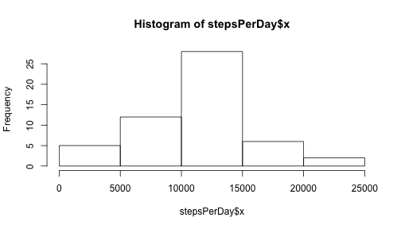
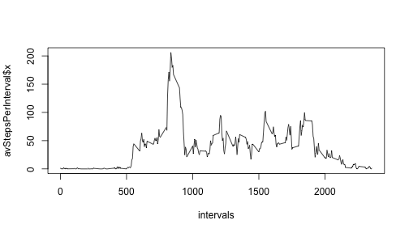
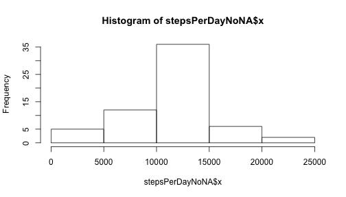
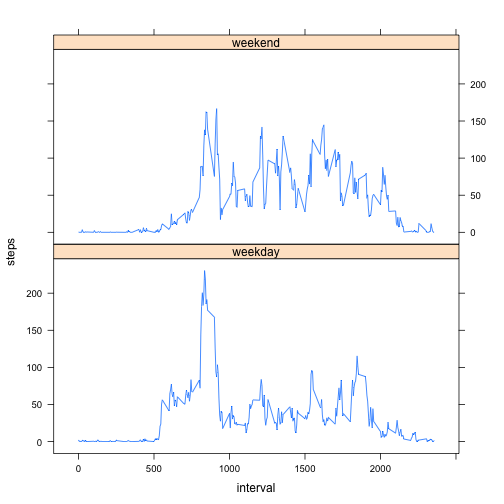

## Loading and preprocessing the data


```r
data <- read.csv('./activity.csv')
```


## What is mean total number of steps taken per day?

Calculate the total number of steps taken per day and make a histogram:

```r
stepsPerDay <- aggregate(data$steps, by=list(data$date), FUN=sum)
hist(stepsPerDay$x)
```

 

Now calculate the mean and median of the total number of steps taken per day:

```r
mean(stepsPerDay$x, na.rm=TRUE)
```

```
## [1] 10766.19
```

```r
median(stepsPerDay$x, na.rm=TRUE)
```

```
## [1] 10765
```


## What is the average daily activity pattern?

Make a plot of average number of steps taken per interval, averaged across all days:

```r
avStepsPerInterval <- aggregate(data$steps, by=list(data$interval), mean, na.rm=TRUE)
intervals <- unique(data$interval)
plot(intervals,avStepsPerInterval$x, type='l')
```

 

Find 5-minute interval, on average across all the days in the dataset, that contains the maximum number of steps:

```r
avStepsPerInterval[avStepsPerInterval$x==max(avStepsPerInterval$x),1]
```

```
## [1] 835
```

## Imputing missing values

Calculate the total number of missing values in the dataset:

```r
table(complete.cases(data))[1]
```

```
## FALSE 
##  2304
```

Using mean value of number of steps in each interval to fill missing values, create a new dataset:

```r
library(dplyr)
dataNoNA <- data %>% group_by(interval) %>% 
            mutate(steps = replace(steps, is.na(steps), mean(steps, na.rm=TRUE)))
```

Make a histogram of the total number of steps taken each day and calculate the mean and median total number of steps taken per day:

```r
stepsPerDayNoNA <- aggregate(dataNoNA$steps, by=list(dataNoNA$date), FUN=sum)
hist(stepsPerDayNoNA$x)
```

 

```r
mean(stepsPerDayNoNA$x)
```

```
## [1] 10766.19
```

```r
median(stepsPerDayNoNA$x)
```

```
## [1] 10766.19
```
After imputing mean value of number of steps in each interval to fill missing values, mean value of number of steps per day has not changed. Median value is now equal to mean value. 

## Are there differences in activity patterns between weekdays and weekends?

Create a new factor variable in the dataset with two levels – “weekday” and “weekend” indicating whether a given date is a weekday or weekend day:

```r
dataNoNA$dayType <- weekdays(as.Date(dataNoNA$date))
dataNoNA <- transform(dataNoNA, dayType = 
                           replace(dayType, dayType %in% c("Saturday", "Sunday"),    
                                   "weekend"))    
dataNoNA <- transform(dataNoNA, dayType = 
                           replace(dayType, dayType != "weekend", "weekday"))    
dataNoNA$dayType <- as.factor(dataNoNA$dayType)
```

Make a panel plot of the 5-minute interval (x-axis) and the average number of steps taken, averaged across all weekday days or weekend days (y-axis):

```r
library(lattice)
avStepsPerIntervalWeekdays <- aggregate(steps ~ dayType + interval, 
                                       data=dataNoNA, mean)
xyplot(steps~interval|dayType, data=avStepsPerIntervalWeekdays, type='l', layout=c(1,2))
```

 
